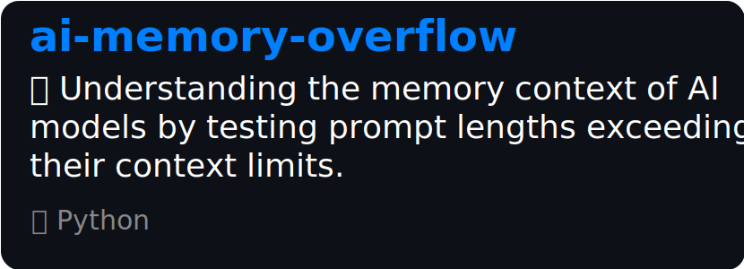

## 👋 Hi! I'm tercmd.

I create stuff. Some on GitHub.

## 📚 What I've made!

I've created a repo with over **13,000 views** about the ChatGPT web app's backend APIs and more. Check it out!

<a href="https://github.com/terminalcommandnewsletter/everything-chatgpt">
  <picture>
    <source media="(prefers-color-scheme: dark)" width="415px" srcset="./img/repos/dark/everything-chatgpt.svg">
    <source media="(prefers-color-scheme: light)" width="415px" srcset="./img/repos/light/everything-chatgpt.svg">
    
  </picture>
</a>

Or, check out this repo testing ChatGPT's memory context length (contribute more models!).

<a href="https://github.com/terminalcommandnewsletter/ai-memory-overflow">
  <picture>
    <source media="(prefers-color-scheme: dark)" width="415px" srcset="./img/repos/dark/ai-memory-overflow.svg">
    <source media="(prefers-color-scheme: light)" width="415px" srcset="./img/repos/light/ai-memory-overflow.svg">
    
  </picture>
</a>

Here's a demo of using CSS to create windows (the ones you can see through)!

<a href="https://github.com/terminalcommandnewsletter/just-some-windows">
  <picture>
    <source media="(prefers-color-scheme: dark)" width="415px" srcset="./img/repos/dark/just-some-windows.svg">
    <source media="(prefers-color-scheme: light)" width="415px" srcset="./img/repos/light/just-some-windows.svg">
    
  </picture>
</a>

And <a href="https://github.com/terminalcommandnewsletter?tab=repositories">here</a> are my other repos.

## 💬 Contact me!

I'm on <a href="https://l.tercmd.com/tw">Twitter @tercmd</a>. My DMs are open, and I check Twitter frequently, so it's the best way to reach me ([Click here to DM me](https://twitter.com/messages/compose?recipient_id=1497118334026129409)).

I also run <a href="https://www.tercmd.com">tercmd.com</a>. You can contact me by emailing contact@ on that domain.
